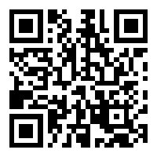

# xml-sec

Pure Rust XML Security library. Drop-in replacement for libxmlsec1.

**No C dependencies. No cmake. No system libraries. Just `cargo add xml-sec`.**

> [!WARNING]
> Early-stage pre-release. The API is unstable, XMLDSig/XMLEnc coverage is still incomplete,
> and this crate should not yet be used in production.

## Features

- **C14N** — XML Canonicalization (inclusive + exclusive, W3C compliant)
- **XMLDSig** — XML Digital Signatures (sign + verify, enveloped/enveloping/detached)
- **XMLEnc** — XML Encryption (symmetric + asymmetric)
- **X.509** — Certificate-based key extraction and validation

## Why?

Every SAML, SOAP, and WS-Security implementation depends on libxmlsec1 — a C library that:
- Requires cmake + libxml2 + OpenSSL/NSS/GnuTLS to build
- Breaks on Alpine/musl static linking
- Has decades of CVEs in XML parsing and signature validation
- Cannot cross-compile easily

`xml-sec` is a ground-up Rust rewrite using `roxmltree` + `ring` + `x509-parser`. Single `cargo build`, works everywhere Rust works.

## Status

**Pre-release.** API is unstable. Not ready for production use.

Currently implemented (core paths):
- C14N 1.0, C14N 1.1, and Exclusive C14N
- XMLDSig parsing, same-document URI dereference, transform chains, and digest verification
- RSA PKCS#1 v1.5 verification helpers for SHA-1 / SHA-256 / SHA-384 / SHA-512

Still in progress:
- End-to-end XMLDSig `VerifyContext`
- XMLDSig signing pipeline
- XMLEnc encryption/decryption pipeline

Current toolchain target: latest stable Rust.
Current MSRV: Rust 1.92.

## Specifications

| Spec | Status |
|------|--------|
| [Canonical XML 1.0](https://www.w3.org/TR/xml-c14n/) | Partially implemented |
| [Canonical XML 1.1](https://www.w3.org/TR/xml-c14n11/) | Partially implemented |
| [Exclusive C14N](https://www.w3.org/TR/xml-exc-c14n/) | Partially implemented |
| [XMLDSig](https://www.w3.org/TR/xmldsig-core1/) | Partially implemented |
| [XMLEnc](https://www.w3.org/TR/xmlenc-core1/) | Planned |

## License

Apache-2.0

## Support the Project

If `xml-sec` is useful in your stack, you can help fund continued implementation and maintenance.

USDT (TRC-20): `TFDsezHa1cBkoeZT5q2T49Wp66K8t2DmdA`

